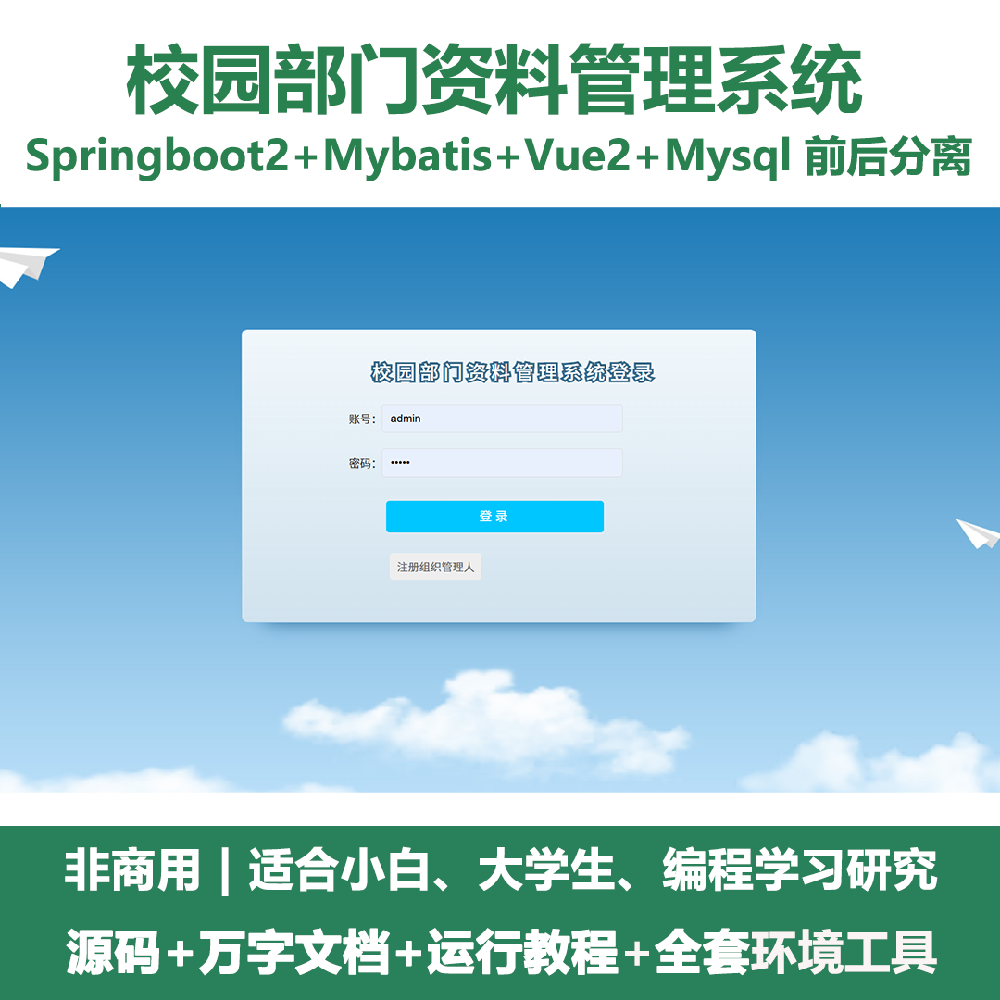
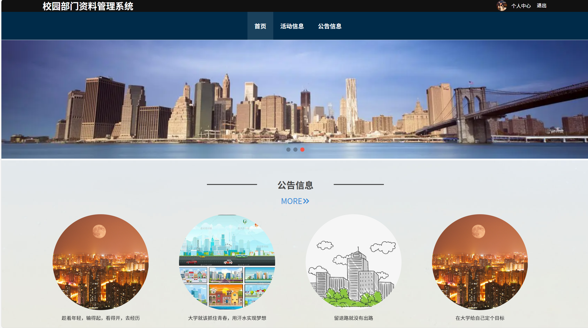
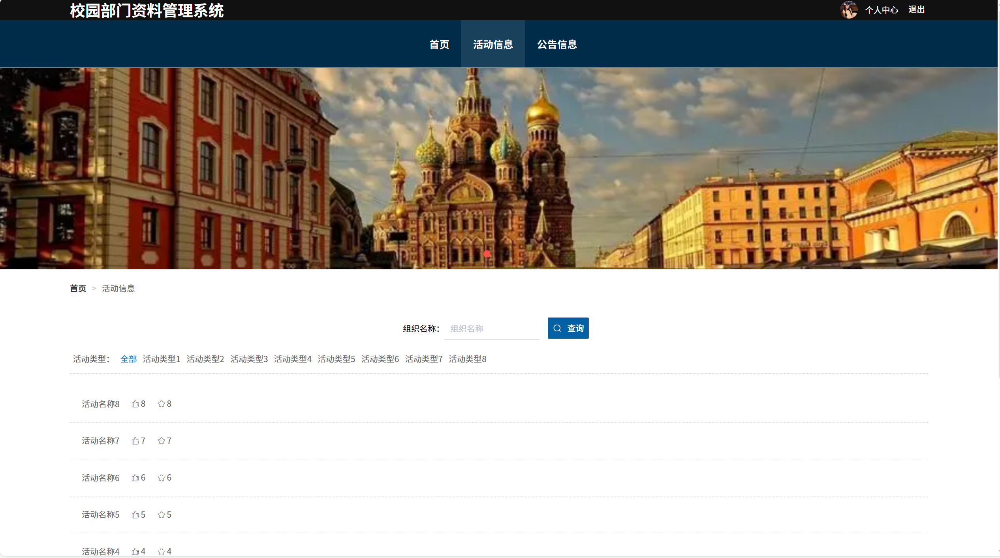
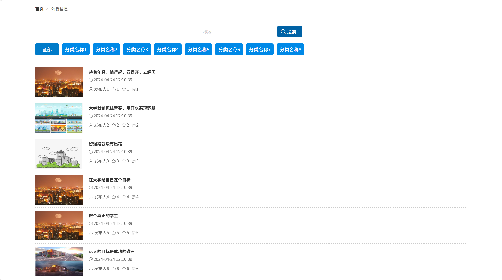
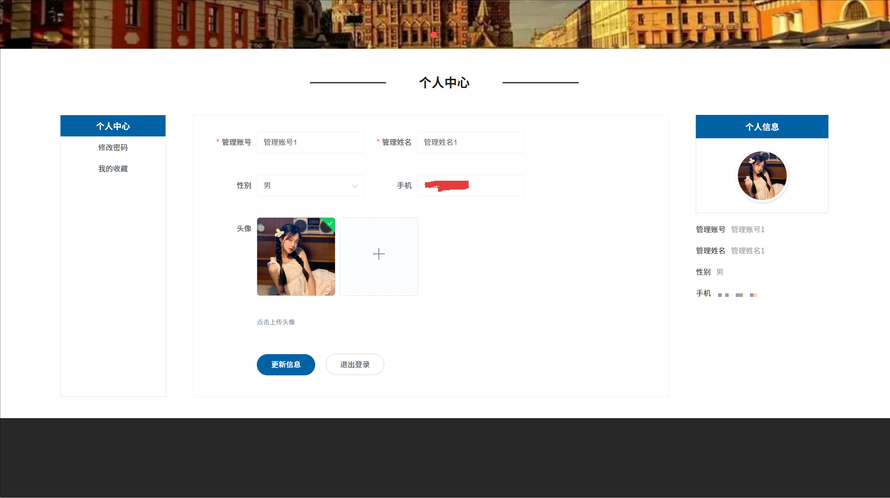
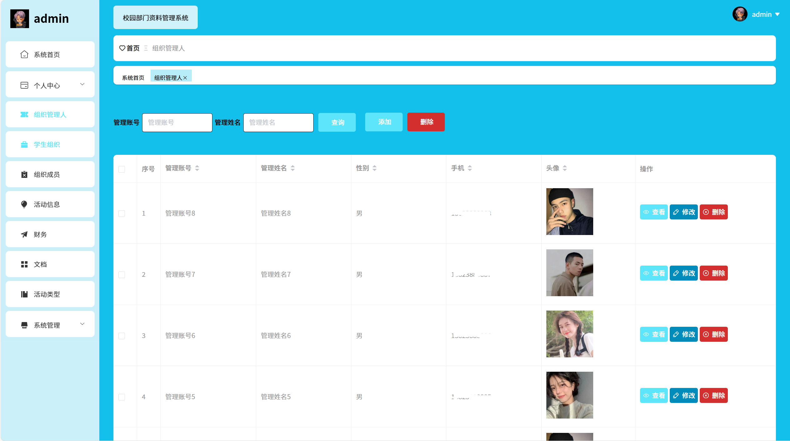
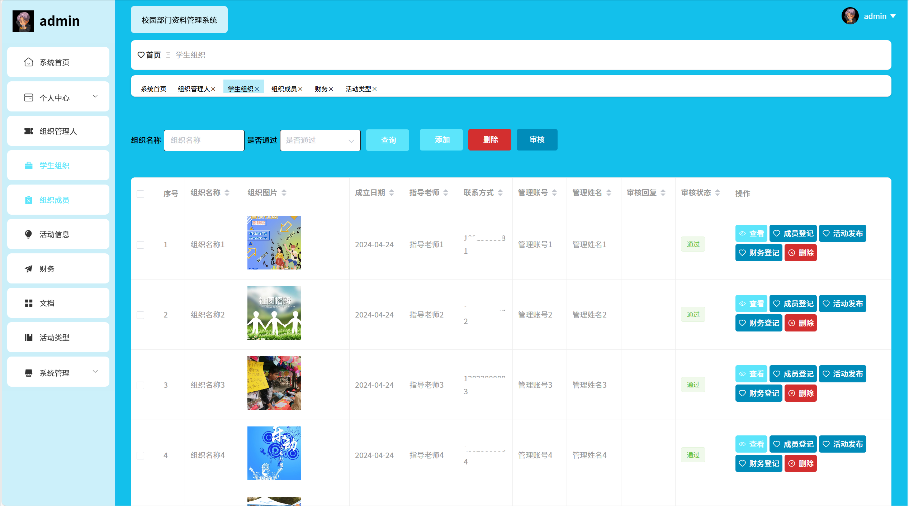
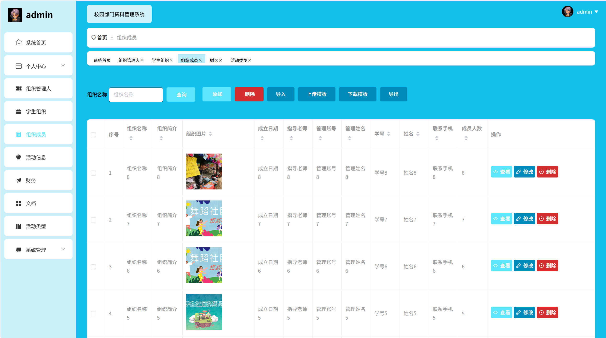
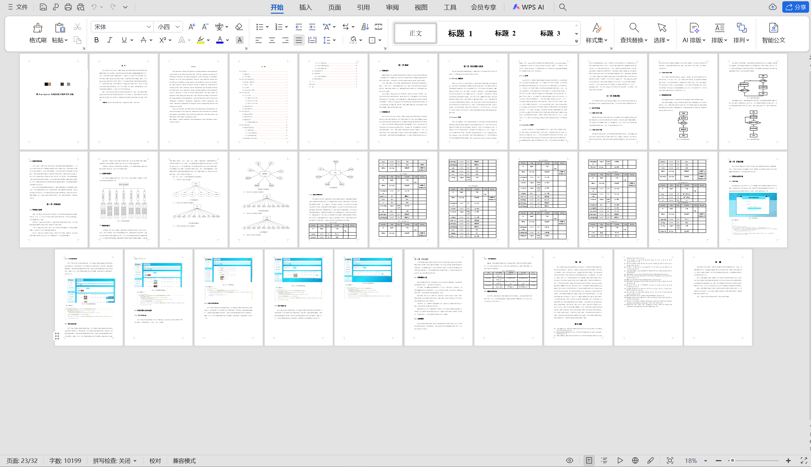

# springbootA422
springbootA422校园部门资料管理系统+LW
 
## 查看主页获取源码

### 一、关键词

校园部门文档管理系统，校园行政资料管理系统，校园部门信息资源管理系统
 

### 二、作品包含

源码+数据库+设计文档万字+全套环境和工具资源+部署教程

 

### 三、项目技术

前端技术：Html、Css、Js、Vue2.0、Element-ui 
后端技术：Java、SpringBoot2.0、MyBatis

  

 

### 四、运行环境（以下版本亲测，其他版本未知，请自测）

开发工具：IDEA/eclipse  + VSCODE

数据库：MySQL5.7（最低要5.7版本）

数据库管理工具：Navicat10以上版本

环境配置软件： JDK1.8 + Maven3.6.3

前端Nodejs：14

浏览器：谷歌浏览器

 

### 五、项目介绍

项目编号：springbootA422

 基于Spring Boot的解决方案，以解决现有系统的缺陷。随后，结合Spring Boot框架的特点和优势，提出了一种全新的校园部门资料管理系统架构设计。在系统实现方面，本文详细介绍了Spring Boot框架的应用。同时，针对校园部门资料管理系统的需求，设计了用户管理、部门管理、组织成员管理、活动信息管理等功能模块，并实现了相应的功能和界面。
 
### 六、运行截图

